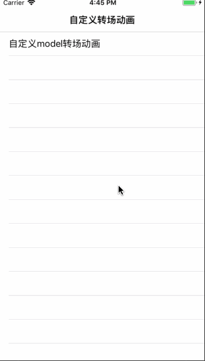

# HLCustomTransitions

[](https://travis-ci.org/2461414445@qq.com/HLCustomTransitions)
[](https://cocoapods.org/pods/HLCustomTransitions)
[](https://cocoapods.org/pods/HLCustomTransitions)
[](https://cocoapods.org/pods/HLCustomTransitions)

## Example

clone 项目 然后运行`pod install` 来看实例效果

一行代码实现自定义多个方向的转场动画 
-  无耦合 
- 高效率转场 
- 稳定性好



## Installation

HLCustomTransitions is available through [CocoaPods](https://cocoapods.org). To install
it, simply add the following line to your Podfile:

```ruby
pod 'HLCustomTransitions'
```

## Usage
- 设置控制器尺寸
```
//在MineViewController中写
- (void)viewWillLayoutSubviews
{
    //设置控制器显示的尺寸
    self.view.frame = CGRectMake(0, 100, self.view.bounds.size.width, 500);
}

```

- 使用专场动画
```
//创建要model的控制器实例控制器对象
MineViewController *mineVC = [[MineViewController alloc]init];

//创建转场动画实例对象 并设置专场动画方向的枚举值（有四个枚举值）
HLCustomPresentationController *presentationController = [[HLCustomPresentationController alloc]initWithPresentedViewController:mineVC presentingViewController:self presentedDirection:UIPresentationControllerDirectionFromLeft];

//设置专场动画的代理为自定义转场动画实例
mineVC.transitioningDelegate = presentationController;

[self presentViewController:mineVC animated:YES completion:NULL];
```

- 或者直接下载 `HLCustomPresentationController.h HLCustomPresentationController.m`文件 拖入项目中进行使用

## Author

2461414445@qq.com, 2461414445@qq.com

## License

HLCustomTransitions is available under the MIT license. See the LICENSE file for more info.
